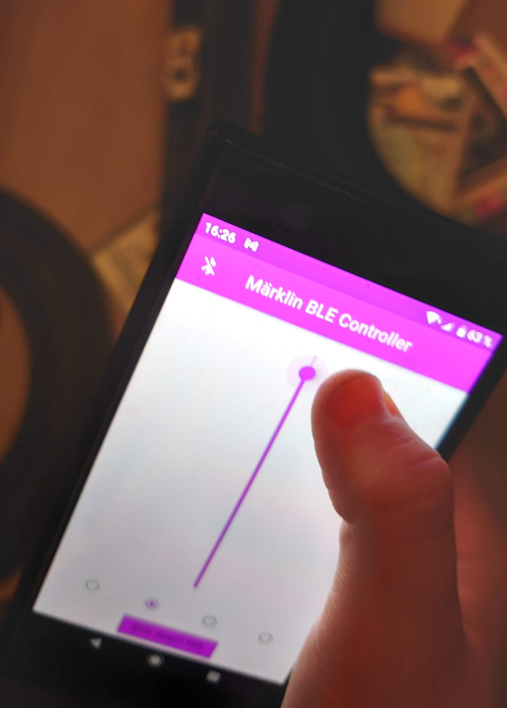
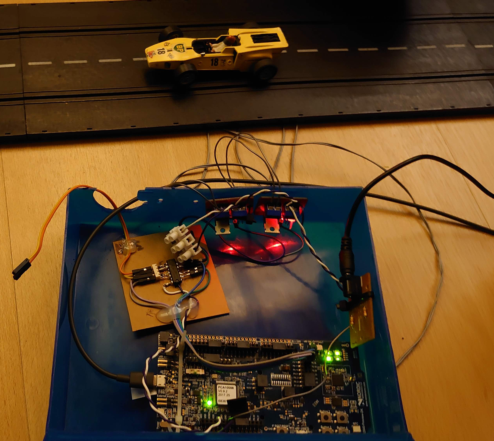

# Märklin Bluetooth Car Controller

My uncle always celebrates Christmas with our family, since he doesn't have his own. He always brings his old Märklin Sprint racetrack that he used to play with as a kid, and then the day before Christmas we build as long of a track as we can and race against each other. It's a really fun and much appreciated tradition. 

BUT, there is one problem... The racetrack has these really old-school hand controllers with wires. They really limit your movement, and whenever you run off the track (that happens a lot, we're not very good drivers) you have to put the controller away before moving across the room to put the car back on the track, which means you lose precious time. 

So, me and dad decided to make our own hand controllers, using Bluetooth to avoid the wires. I build the mobile application, he does the other end using an nRF bluetooth thing (I don't really know what it is, I'm not good at those things), and then we do the hardware together.

Oh, and also. This is very much a homebrew project. It is not meant to be sold or distributed in any way; we do this purely for fun. Don't look at the code to closely (it's quite bad), and keep in mind that I'm no professional. I'm learning (slowly, but still), and that's the whole point.

## The setup

On the "client" side, we have my beautiful mobile app made using Flutter (it's great, you should [check it out](https://flutter.dev/)).

On the "server" side, we have this nRF52840 thing which handles Bluetooth. It's also great, and it can handle many Bluetooth connections at once, which is handy since you usually want to be more than one person racing at once.

Everything is wired up in this very ugly blue plastic box. It works great, even though it's ugly. And it has a hole for the wires! (which dad accidentally created when trying to punch a hole in the box for fastening one of the parts).

It has support for 4 cars running at once, but we currently only use two (hence the loose wires).